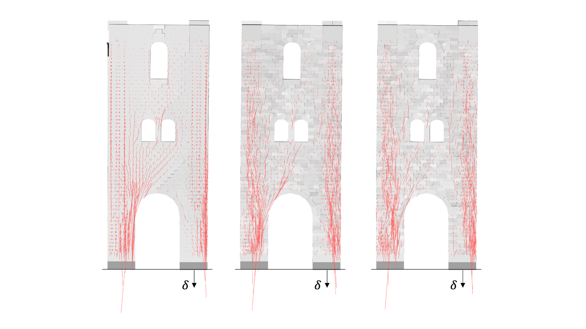

# About

<figure><figcaption></figcaption></figure>

## Welcome to COMPAS Masonry

COMPAS Masonry is a plugin for Rhino 8 for the equilibrium analysis of discrete-element structures,
and for the stability assessment of (historic) masonry structures.

The plugin is written entirely in Python using the [COMPAS framework](https://compas.dev),
and can be installed in Rhino 8 using Yak, the official package manager for Rhino.


**To do:** welcome text in the voice of the RhinoVAULT About page: who it is for, what it answers, an invitation to share projects.


## Open-source Research Platform

The source code of COMPAS Masonry is hosted on [GitHub](https://github.com/BlockResearchGroup/compas-Masonry).
Please use the [issue tracker](https://github.com/BlockResearchGroup/compas-Masonry/issues)
or the [COMPAS forum](https://forum.compas-framework.org/) to report bugs, technical problems or feature requests.

COMPAS Masonry uses the following COMPAS packages. Each link goes to the documentation of that package,
which is where its data structures, algorithms and API are documented.

* [compas](https://compas.dev/compas/latest/) — core geometry, data structures, JSON serialisation, Rhino scene
* [compas_model](https://blockresearchgroup.github.io/compas_model/) — model / element / interaction graph
* [compas_dem](https://blockresearchgroup.github.io/compas_dem/latest/) — block models, contacts, problems, solvers and results
* [compas_cra](https://blockresearchgroup.github.io/compas_cra/) — RBE and CRA equilibrium solvers
* [compas_lmgc90](https://github.com/BlockResearchGroup/compas_lmgc90) — LMGC90 contact-dynamics solver (no docs site yet: repository)
* [compas_3dec](https://github.com/BlockResearchGroup/compas_3dec) — adapter to Itasca 3DEC (no docs site yet: repository)
* [compas_session](https://blockresearchgroup.github.io/compas_session/latest/) — session, undo/redo, save/open
* [compas_rui](https://blockresearchgroup.github.io/compas_rui/latest/) — Rhino toolbars, forms and UI helpers
* [compas_cgal](https://compas.dev/compas_cgal/) — geometry operations (CGAL)
* [compas_libigl](https://compas.dev/compas_libigl/latest/) — geometry operations (libigl)


**To do:** COMPAS ecosystem diagram (RhinoVAULT shows one here). `requirements.txt` also lists compas_tna, compas_tno and compas_rbe: TNA/TNO are out of scope for this release and compas_rbe is imported nowhere — decide whether they stay in the requirements (plan §9, Q8).


## Citing COMPAS Masonry

If you use COMPAS Masonry for projects, publications or other applications, please cite it.
See [Citing COMPAS Masonry](additional-information/citing.md).

## Disclaimer


**To do:** disclaimer text (what the results do and do not mean for a structural assessment), consistent with [Legal Terms](additional-information/legal.md).

