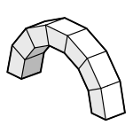

# 1a. Blocks

|  |  |  |
| :-: | --- | --- |
| 

 | 
<strong>Rhino command name</strong>

<code>CM_Model_blocks</code>
 | 
<strong>source file</strong>

<a href="https://github.com/BlockResearchGroup/compas-Masonry/blob/main/commands/CM_Model_blocks.py"><code>CM_Model_blocks.py</code></a>
 |

Creates the block model: the set of rigid blocks that represents the structure. A block model can be generated from a template, built from Rhino geometry, or loaded from a JSON file.


**To do:** figure of a generated arch; explain when to use templates vs. Rhino geometry.


## Sub-commands

### Arch

| Option | Default |
| --- | --- |
| Rise | 3.0 |
| Span | 6.0 |
| Thickness | 0.5 |
| Depth | 0.5 |
| Blocks | 15 |

### Dome

| Option | Default | Unit |
| --- | --- | --- |
| Meridians | 20 |  |
| Hoops | 10 |  |
| OculusAngle | π/30 | rad |
| SpringingAngle | π/2 | rad |
| InnerRadiusSpringing | 3.9 |  |
| InnerRadiusOculus | 3.2 |  |
| OuterRadiusSpringing | 4.0 |  |
| OuterRadiusOculus | 3.5 |  |

### BarrelVault

| Option | Default |
| --- | --- |
| Span | 6.0 |
| Length | 6.0 |
| Rise | 3.0 |
| Thickness | 0.5 |
| SpanBlocks | 20 |
| LengthBlocks | 20 |

### RhinoMeshes

Select Rhino meshes; each mesh becomes a block.

### RhinoPolysurfaces

Select closed polysurfaces; each polysurface becomes a block.

### Json

| Option | Default |
| --- | --- |
| Path | `~/blockmodel.json` |


**To do:** confirm the one-line descriptions of RhinoMeshes / RhinoPolysurfaces / Json, and the length units of the template options.



**Under the hood** — creates a [BlockModel](https://blockresearchgroup.github.io/compas_dem/latest/api/generated/compas_dem.models.BlockModel.html) from **compas_dem**, using the compas_dem templates for Arch, Dome and BarrelVault.

