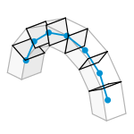

# 1b. Contacts

|  |  |  |
| :-: | --- | --- |
| 

 | 
<strong>Rhino command name</strong>

<code>CM_Model_contacts</code>
 | 
<strong>source file</strong>

<a href="https://github.com/BlockResearchGroup/compas-Masonry/blob/main/commands/CM_Model_contacts.py"><code>CM_Model_contacts.py</code></a>
 |

Computes the contacts (interfaces) between the blocks of the model. Tolerance and minimum contact area are asked together as command line options.

## Options

| Option | Default | Meaning |
| --- | --- | --- |
| Contact Tolerance | 0.001 | geometric tolerance for detecting touching faces |
| Contact Minimum Area | 0.01 | contacts with a smaller area are ignored |


Recomputing the contacts deletes every stored result set (and anything drawn from it), because results refer to the contacts of the old model. The command asks for confirmation first.



**To do:** figure of the contacts drawn on the arch; confirm the meaning column.



**Under the hood** — calls `compute_contacts` on the [BlockModel](https://blockresearchgroup.github.io/compas_dem/latest/api/generated/compas_dem.models.BlockModel.html) (**compas_dem**). The defaults come from [5. Settings](../5-settings.md).

