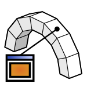

# 1d. Materials

## Manage materials

|  |  |  |
| --- | --- | --- |
|  | 
<strong>Rhino command name</strong>

<code>CM_Model_material</code>
 | 
<strong>source file</strong>

<a href="https://github.com/BlockResearchGroup/compas-Masonry/blob/main/commands/CM_Model_material.py"><code>CM_Model_material.py</code></a>
 |

Creates and manages the materials of the model.

### Sub-commands

`Create` · `Modify` · `Remove` · `Clear` · `Duplicate`

### Create

| Option | Values |
| --- | --- |
| Type | Stone / Generic |
| Source | Predefined / Custom |

Predefined materials are printed as a table with all their values before you pick one. A custom material asks for:

| Property | Default | Unit | Note |
| --- | --- | --- | --- |
| Name | Material |  |  |
| Fck | 0.0 | MPa | characteristic compressive strength (0 = unset) |
| Ft | 0.0 | MPa | tensile strength (0 = derive from fck) |
| Ecm | 0.0 | MPa | modulus of elasticity (0 = unset) |
| Density | 2400.0 | kg/m3 |  |
| Poisson | 0.2 |  | Poisson's ratio |

***

## Assign materials

|  |  |  |
| --- | --- | --- |
|  | 
<strong>Rhino command name</strong>

<code>CM_Model_materialassign</code>
 | 
<strong>source file</strong>

<a href="https://github.com/BlockResearchGroup/compas-Masonry/blob/main/commands/CM_Model_materialassign.py"><code>CM_Model_materialassign.py</code></a>
 |

Assigns a material to blocks.

| Option | Values |
| --- | --- |
| Material | one of the materials in the model |
| AssignTo | All / Selected |


The CRA and RBE solvers use the density of the material. A block without a material cannot be solved with them.



**Under the hood** — materials are compas_dem material objects; see the [compas_dem material module](https://blockresearchgroup.github.io/compas_dem/latest/api/compas_dem.material.html).

