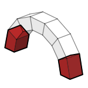

# 1c. Supports

|  |  |  |
| :-: | --- | --- |
| 

 | 
<strong>Rhino command name</strong>

<code>CM_Model_supports</code>
 | 
<strong>source file</strong>

<a href="https://github.com/BlockResearchGroup/compas-Masonry/blob/main/commands/CM_Model_supports.py"><code>CM_Model_supports.py</code></a>
 |

Defines which blocks are supports.

## Sub-commands

### Add

Select blocks to make them supports.

### Remove

Select supports to turn them back into free blocks.

### Clear

Remove all supports.


Supports are copied onto each problem when the problem is created. When you change the supports and problems already exist, the command offers to update them.



**To do:** figure; describe how supports are drawn (layer `Masonry::Model::Supports`).



**Under the hood** — sets `is_support` on the blocks of the [BlockModel](https://blockresearchgroup.github.io/compas_dem/latest/api/generated/compas_dem.models.BlockModel.html) (**compas_dem**).

