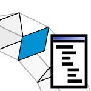

# 2b. Contact Law

|  |  |  |
| --- | --- | --- |
|  | 
<strong>Rhino command name</strong>

<code>CM_Problem_contactlaw</code>
 | 
<strong>source file</strong>

<a href="https://github.com/BlockResearchGroup/compas-Masonry/blob/main/commands/CM_Problem_contactlaw.py"><code>CM_Problem_contactlaw.py</code></a>
 |

Sets the contact law (Mohr-Coulomb) and the joint model of the active problem, in one prompt. A problem holds one contact law and one joint model; setting them again overwrites them. To compare contact laws, duplicate the problem.

## Options

| Option | Default | Unit | Note |
| --- | --- | --- | --- |
| FrictionInput | Phi |  | enter friction as angle (Phi) or coefficient (Mu) |
| Phi | 35.0 | deg | friction angle |
| Mu | 0.7 |  | friction coefficient |
| Cohesion | 0.0 | Pa | 0 = none |
| TensileCutoff | 0.0 | Pa | 0 = none |
| NormalStiffness | 100e9 | Pa | joint model kn |
| TangentialStiffness | 70e9 | Pa | joint model kt |

Fields are seeded with the values the problem already has; the defaults above apply to a new problem.


**To do:** say which solvers use which parameters (e.g. the joint stiffnesses).



**Under the hood** — sets the [ContactProperties](https://blockresearchgroup.github.io/compas_dem/latest/api/generated/compas_dem.interactions.ContactProperties.html) of the [Problem](https://blockresearchgroup.github.io/compas_dem/latest/api/generated/compas_dem.problem.Problem.html) (**compas_dem**).

