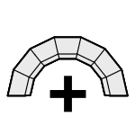

# 2a. Create Problem

|  |  |  |
| :-: | --- | --- |
| 

 | 
<strong>Rhino command name</strong>

<code>CM_Problem_create</code>
 | 
<strong>source file</strong>

<a href="https://github.com/BlockResearchGroup/compas-Masonry/blob/main/commands/CM_Problem_create.py"><code>CM_Problem_create.py</code></a>
 |

Creates, duplicates, activates or deletes a problem. A problem is one analysis case on the model: one contact law, one solver, and a set of loads and prescribed displacements. The other Problem commands act on the **active** problem.

## Sub-commands

| Sub-command | Effect |
| --- | --- |
| New | create a problem (named `Problem_<n>` by default) |
| Duplicate | copy an existing problem |
| SetActive | make a problem the active one |
| Delete | delete a problem |

Each problem gets its own layer, `Masonry::<index>_<name>`. Its boundary conditions are drawn under `…::BoundaryConditions::<group>` and its results under `…::Results::<key>`.


**To do:** figure of the layer panel with two problems.



**Under the hood** — creates a [Problem](https://blockresearchgroup.github.io/compas_dem/latest/api/generated/compas_dem.problem.Problem.html) from **compas_dem**.

