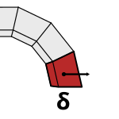

# 2e. Displacements

|  |  |  |
| :-: | --- | --- |
| 

 | 
<strong>Rhino command name</strong>

<code>CM_Problem_displacements</code>
 | 
<strong>source file</strong>

<a href="https://github.com/BlockResearchGroup/compas-Masonry/blob/main/commands/CM_Problem_displacements.py"><code>CM_Problem_displacements.py</code></a>
 |

Adds or removes prescribed displacements and rotations on the active problem, organised in groups.


CRA and RBE solve self-weight only. A problem with prescribed displacements must be solved with LMGC90 or 3DEC.


## Sub-commands

### Add

| Option | Default | Unit | Shown for |
| --- | --- | --- | --- |
| Group | new group |  | all |
| Name | next free group name |  | new group |
| Type | Translation |  | Translation / Rotation |
| ConstrainX/Y/Z | Fixed |  | Translation (Free / Fixed) |
| DX, DY, DZ | 0.0 | m | Translation, fixed axes |
| ConstrainRX/RY/RZ | Fixed |  | Rotation (Free / Fixed) |
| RX, RY, RZ | 0.0 | rad | Rotation, fixed axes |

### Remove

`One` displacement, or a whole `Group`.


**To do:** figure; explain Free vs. Fixed per axis.



**Under the hood** — adds displacement boundary conditions to the [Problem](https://blockresearchgroup.github.io/compas_dem/latest/api/generated/compas_dem.problem.Problem.html); see the [compas_dem problem module](https://blockresearchgroup.github.io/compas_dem/latest/api/compas_dem.problem.html).

