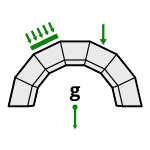

# 2d. Loads

|  |  |  |
| :-: | --- | --- |
| 

 | 
<strong>Rhino command name</strong>

<code>CM_Problem_loads</code>
 | 
<strong>source file</strong>

<a href="https://github.com/BlockResearchGroup/compas-Masonry/blob/main/commands/CM_Problem_loads.py"><code>CM_Problem_loads.py</code></a>
 |

Adds loads to, or removes loads from, the active problem. Loads are organised in groups; each group is drawn on its own layer.


CRA and RBE solve self-weight only. A problem with loads must be solved with LMGC90 or 3DEC.


## Sub-commands

### Add

| Option | Default | Unit | Shown for |
| --- | --- | --- | --- |
| Group | new group |  | all |
| Name | next free group name |  | new group |
| LoadType | Point |  | Point / Surface / Moment / BodyForce |
| At | Vertex |  | Point (Vertex / Face) |
| Direction | Type |  | Point, Surface (Type / Draw) |
| Fx, Fy, Fz | 0, 0, -1000 | N | Point, typed |
| Magnitude | 1000.0 | N | Point, drawn |
| Tx, Ty, Tz | 0, 0, -1000 | N/m2 | Surface, typed |
| Magnitude | 1000.0 | N/m2 | Surface, drawn |
| Mx, My, Mz | 0, 0, 0 | Nm | Moment |
| Ax, Ay, Az | 0, 0, 0 | m/s2 | BodyForce |
| Loading | Ramp |  | Ramp / Instantaneous |

### Remove

`One` load, or a whole `Group`.


**To do:** explain point vs. surface loads and the Type / Draw direction input with figures.



**Under the hood** — adds load boundary conditions to the [Problem](https://blockresearchgroup.github.io/compas_dem/latest/api/generated/compas_dem.problem.Problem.html); see the [compas_dem problem module](https://blockresearchgroup.github.io/compas_dem/latest/api/compas_dem.problem.html).

