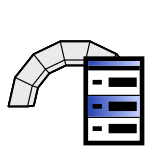

# 2c. Solver

|  |  |  |
| :-: | --- | --- |
| 

 | 
<strong>Rhino command name</strong>

<code>CM_Problem_setsolver</code>
 | 
<strong>source file</strong>

<a href="https://github.com/BlockResearchGroup/compas-Masonry/blob/main/commands/CM_Problem_setsolver.py"><code>CM_Problem_setsolver.py</code></a>
 |

Selects and configures the solver of the active problem. A problem holds one solver; selecting a new one replaces it. Running it is a separate step, [3. Solve](../3-solve.md). Cycling the `Solver` option changes which parameters are shown.

## Sub-commands

### CRA

| Option | Default | Values |
| --- | --- | --- |
| Formulation | Plain | Plain / Penalty |
| Timer | NoTiming | NoTiming / Timing |

Installed with the plugin; no external solver is needed. Returns contact forces and no displacements. Solves **self-weight only**: a problem with loads or prescribed displacements is refused. The penalty formulation permits tension at the contacts.

### RBE

| Option | Default | Values |
| --- | --- | --- |
| Timer | NoTiming | NoTiming / Timing |

Installed with the plugin. Returns contact forces and no displacements. Solves **self-weight only**.

### LMGC90

| Option | Default | Unit |
| --- | --- | --- |
| Duration | 1.0 | s |
| Steps | 100 |  |

Needs `compas_lmgc90`, which is installed in the Rhino environment. If it is missing, the option says so. Returns displacements and contact forces.

### 3DEC

| Option | Default | Values / unit |
| --- | --- | --- |
| Version | 7.0 | 7.0 / 9.0 |
| Executable | (empty: found automatically) | path |
| Workspace | (empty) | directory for the 3DEC runs |
| Ratio | 1e-5 |  |
| GravitySteps | 10 |  |
| Timeout | 0.0 | s |
| Output | Quiet | Terminal / Quiet |

Needs a licensed installation of [Itasca 3DEC](https://www.itascacg.com/software/3dec). The executable is discovered automatically when no path is set.


**To do:** meaning of Ratio, GravitySteps and Timeout; what 'Formulation' changes in the results; screenshots.



**Under the hood** — sets a [Solver](https://blockresearchgroup.github.io/compas_dem/latest/api/generated/compas_dem.problem.Solver.html) on the [Problem](https://blockresearchgroup.github.io/compas_dem/latest/api/generated/compas_dem.problem.Problem.html) (**compas_dem**). CRA and RBE run through [compas_cra](https://blockresearchgroup.github.io/compas_cra/reference/compas_cra.equilibrium/); LMGC90 through [compas_lmgc90](https://github.com/BlockResearchGroup/compas_lmgc90); 3DEC through [compas_3dec](https://github.com/BlockResearchGroup/compas_3dec). See also [Discrete Element Analysis](../../background/dea.md).

