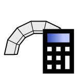

# 3. Solve

|  |  |  |
| :-: | --- | --- |
| 

 | 
<strong>Rhino command name</strong>

<code>CM_Problem_solve</code>
 | 
<strong>source file</strong>

<a href="https://github.com/BlockResearchGroup/compas-Masonry/blob/main/commands/CM_Problem_solve.py"><code>CM_Problem_solve.py</code></a>
 |

Solves the active problem with its solver. Every load and displacement group on the problem is solved; to solve a different set, duplicate the problem.

Solving draws **nothing**. Each solve stores one result set in the session under a key naming the solver and the time it ran (for example `RBE_2026-08-04T15-30-12`), so a re-solve after changing a material or a contact law is kept next to the earlier run. Use [4. Results](4-results/README.md) to draw or print it.


CRA and RBE are refused for a problem with loads or prescribed displacements, because they would silently return a self-weight answer. They also need a material density on every block and a contact law on the problem; the command names what is missing.


## 3DEC stages

With 3DEC, each load and displacement group runs as a sequential stage after gravity. The command asks whether to use the current stage order or change it, and how to group consecutive loads.


**To do:** figure; describe the 3DEC stage dialogs.



**Under the hood** — calls `solve` on the [Problem](https://blockresearchgroup.github.io/compas_dem/latest/api/generated/compas_dem.problem.Problem.html) and stores a [Results](https://blockresearchgroup.github.io/compas_dem/latest/api/generated/compas_dem.problem.Results.html) object (**compas_dem**) in the session.

