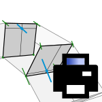

# 4c. Block Results

|  |  |  |
| --- | --- | --- |
|  | 
<strong>Rhino command name</strong>

<code>CM_Results_block</code>
 | 
<strong>source file</strong>

<a href="https://github.com/BlockResearchGroup/compas-Masonry/blob/main/commands/CM_Results_block.py"><code>CM_Results_block.py</code></a>
 |

Shows the results of the blocks you select: the displacement of each block, and every contact it takes part in, with the force, stress and opening at each and the neighbour on the other side.

## Options

All outputs are chosen together; any combination is allowed.

| Option | Default | Effect |
| --- | --- | --- |
| Print | Print | a table per selected block in the command window |
| Tag | NoTag | write the values onto the block's Rhino object as User Text |
| Csv | NoCsv | write one row per (block, contact) to a CSV file |
| View | KeepAll | Isolate: hide every other block and every force that does not touch a selected block |


After `Isolate`, run `CM_Session_redraw` to bring the rest of the model back.



**Under the hood** — reads a [Results](https://blockresearchgroup.github.io/compas_dem/latest/api/generated/compas_dem.problem.Results.html) object (**compas_dem**).

