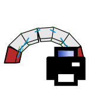

# 4b. Print Results

|  |  |  |
| :-: | --- | --- |
| 

 | 
<strong>Rhino command name</strong>

<code>CM_Results_print</code>
 | 
<strong>source file</strong>

<a href="https://github.com/BlockResearchGroup/compas-Masonry/blob/main/commands/CM_Results_print.py"><code>CM_Results_print.py</code></a>
 |

Prints a stored result set in the command window, without drawing anything.

## Sub-commands

| Sub-command | Prints |
| --- | --- |
| Summary | the maximum of every quantity, with the contact, block or support where it occurs, plus the contact count and total force |
| Contacts | one row per contact: resultant, magnitude, stress, opening |
| Blocks | one row per moved block: displacement vector and magnitude (empty for CRA and RBE, which move nothing) |
| Reactions | the total contact force on each support, and their sum |
| All | all of the above |


**Under the hood** — reads a [Results](https://blockresearchgroup.github.io/compas_dem/latest/api/generated/compas_dem.problem.Results.html) object (**compas_dem**).

