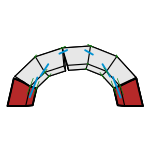

# 4a. Show Results

|  |  |  |
| --- | --- | --- |
|  | 
<strong>Rhino command name</strong>

<code>CM_Results_show</code>
 | 
<strong>source file</strong>

<a href="https://github.com/BlockResearchGroup/compas-Masonry/blob/main/commands/CM_Results_show.py"><code>CM_Results_show.py</code></a>
 |

Draws a stored result set. Results are drawn under the problem's layer, `Masonry::<index>_<problem>::Results::<key>`.

## Sub-commands

| Sub-command | Draws |
| --- | --- |
| Forces | contact resultants and contact geometry (CRA, RBE and others) |
| Displaced | a displaced copy of each block, exaggerated by the displacement scale (solvers that compute displacements, e.g. LMGC90) |
| Both | forces and displaced geometry |

What is drawn (resultants, normal and friction parts, horizontal and vertical parts, reactions, self-weight, corner forces) and how it is scaled is set in [5. Settings](../5-settings.md).


**To do:** figures for Forces and Displaced.



**Under the hood** — reads a [Results](https://blockresearchgroup.github.io/compas_dem/latest/api/generated/compas_dem.problem.Results.html) object (**compas_dem**) from the session.

